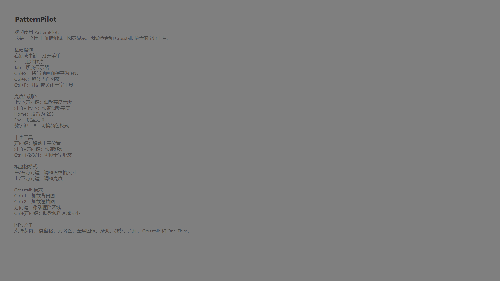

# Screenshots

## Home Screen

The default startup page shows the built-in Chinese quick guide and the PatternPilot branding.

## Checkerboard Pattern

Checkerboard mode supports level adjustment, size adjustment, color switching, and flip operations.

